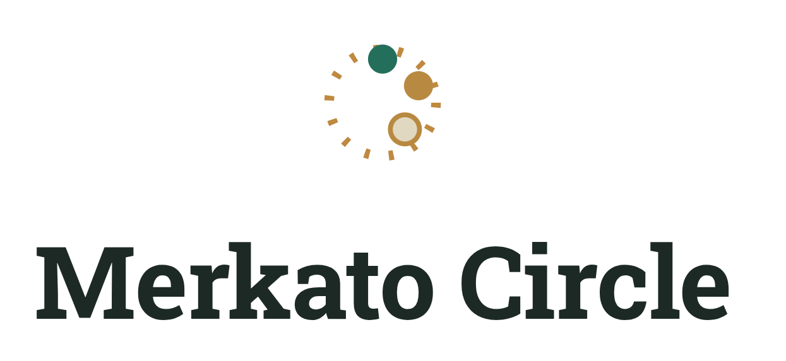

<p align="center">
  
</p>

<h1 align="center">Merkato Circle</h1>

<p align="center">
  <strong>Digital Iqub Manager</strong> — rotating savings circles built for the modern web.
  <br>
  A Spring Boot application with Thymeleaf frontend, enforcing spec 3 business rules,
  Chapa payment integration, and comprehensive automated testing (unit + integration + Selenium).
</p>

<p align="center">
  <a href="#tech-stack"></a>
  <a href="#tech-stack"></a>
  <a href="#tech-stack"></a>
  <a href="#testing"></a>
  <a href="#testing"></a>
  <a href="#testing"></a>
</p>

---

## Table of Contents

- [Tech Stack](#tech-stack)
- [Quick Start](#quick-start)
- [Seeded Accounts](#seeded-accounts)
- [Running Tests](#running-tests)
- [Payment Gateway](#payment-gateway)
- [API Endpoints](#api-endpoints)
- [Project Structure](#project-structure)
- [Features](#features)
- [Configuration](#configuration)

---

## Tech Stack

| Layer | Technology |
|---|---|
| Language | Java 21 |
| Framework | Spring Boot 3.3.4 |
| Security | Spring Security 6 (BCrypt, form login) |
| ORM | Spring Data JPA (Hibernate 6) |
| Database | H2 file-based (`data/iqub.mv.db`) |
| Frontend | Thymeleaf + custom CSS |
| Build | Maven |
| Testing | JUnit 5, Mockito, AssertJ, Selenium 4 |

---

## Quick Start

```bash
# Build and run
mvn spring-boot:run

# Or build the JAR and run it
mvn package
java -jar target/iqub-0.1.0.jar
```

Open **http://localhost:8080** and log in with any seeded account below.

---

## Seeded Accounts

Password for all accounts: **`password123`**

| Email | Role | Scenario |
|---|---|---|
| `selam@merkatocircle.et` | Organizer | Won round 1; active on rounds 2 & 3 |
| `abel@merkatocircle.et` | Member | Paid round 2 late (5% penalty band) |
| `marta@merkatocircle.et` | Member | Eligible for round 3 draw |
| `yonas@merkatocircle.et` | Member | Unpaid on round 3 — use this to drive the payment flow |
| `betty@merkatocircle.et` | Member | Unpaid on round 3 |

---

## Running Tests

```bash
# All tests — unit + integration + controller + Selenium (135 tests)
mvn test

# Unit tests only (54 tests)
mvn test -Dtest=ContributionServiceTest,EligibilityCheckerTest,MemberServiceTest,MembershipServiceTest,RoundServiceTest,BidServiceTest,NotificationServiceTest,RandomWinnerSelectorTest

# Integration tests only (5 tests)
mvn test -Dtest=PersistenceIntegrationTest

# Controller tests only (47 tests)
mvn test -Dtest=*ControllerTest

# Selenium E2E tests only (20 tests)
mvn test -Dtest=IqubSeleniumTest
```

### Test Coverage

- **Equivalence Partitioning / BVA:** penalty bands, bid discount boundaries
- **Decision Table:** eligibility rules (paid + not already won + active membership)
- **State Transition:** round lifecycle (OPEN → OVERDUE → CLOSED), payment state machine
- **Selenium E2E:** all 17 pages plus critical user journeys, using Page Object pattern
- **Integration:** full persistence layer tests with real H2 database
- **Controller:** MockMvc coverage of all authenticated and public endpoints

See `src/test/` for full test sources and `report.md` for the complete testing effort.

---

## Payment Gateway

**No API key or network access required for local development.**

`FakePaymentGateway` is active by default. "Pay with Chapa" redirects to the app's own
`/test/fake-checkout` page same round trip (initiate → checkout → verify → settle),
just with no real money and no outbound calls.

To use real Chapa test-mode:

```bash
export CHAPA_SECRET_KEY=CHASECK_TEST-xxxxxxxxxxxxxxxx
mvn spring-boot:run -Dspring-boot.run.profiles=chapa
```

---

## CI/CD

### GitHub Actions

The pipeline runs on every push and pull request to `main`/`develop`:
- Builds with Java 21
- Runs all tests (unit + integration + Selenium)
- Uploads JaCoCo coverage report
- Uploads Surefire test results

### Jenkins

A `Jenkinsfile` is provided for Docker-based Jenkins:
- Installs Chromium for Selenium
- Runs build, unit tests, Selenium tests, and coverage
- Publishes JaCoCo HTML report and JUnit results

---

## API Endpoints

### Public

| Method | Path | Description |
|---|---|---|
| `GET` | `/login` | Login page |
| `GET` | `/register` | Registration form |
| `POST` | `/register` | Submit registration |
| `GET` | `/payments/return` | Chapa return redirect |
| `GET` | `/payments/chapa/callback` | Chapa server-to-server callback |
| `GET` | `/test/fake-checkout` | Fake checkout page (test mode) |
| `POST` | `/test/fake-checkout/resolve` | Simulate payment outcome |

### Authenticated

| Method | Path | Roles | Description |
|---|---|---|---|
| `GET` | `/dashboard` | ALL | Dashboard with rotation wheel |
| `GET` | `/contribute` | ALL | Payment page for current round |
| `POST` | `/contribute/pay` | ALL | Initiate Chapa payment |
| `GET` | `/rounds` | ALL | List all rounds |
| `GET` | `/rounds/{id}` | ALL | Round detail with contributions |
| `POST` | `/rounds/{id}/draw` | ALL | Run lottery/auction draw |
| `GET` | `/rounds/{id}/bid` | ALL | Bid form for auction rounds |
| `POST` | `/rounds/{id}/bid` | ALL | Submit bid |
| `GET` | `/groups` | ALL | List all groups |
| `POST` | `/groups` | ALL | Create new group |
| `POST` | `/groups/join` | ALL | Join a group |
| `GET` | `/groups/{id}/members` | Organizer/Admin | Manage group members |
| `POST` | `/groups/{id}/members/{mid}/remove` | Organizer/Admin | Remove member |
| `GET` | `/account` | ALL | Account overview |
| `GET` | `/settings` | ALL | Settings page |
| `POST` | `/settings/profile` | ALL | Update profile |
| `POST` | `/settings/password` | ALL | Change password |
| `GET` | `/notifications` | ALL | List notifications |

---

## Project Structure

```
src/main/java/com/merkatocircle/iqub/
├── config/
│   ├── ClockConfig.java              # Clock bean for deterministic dates
│   ├── DataSeeder.java               # Seeds demo scenario on startup
│   ├── SecurityConfig.java           # Spring Security + BCrypt
│   └── WebConfig.java                # Spring MVC config
├── domain/
│   ├── Member.java                   # User entity
│   ├── Iqub.java                     # Group/circle entity
│   ├── Membership.java               # Member ↔ Group join
│   ├── Round.java                    # Round entity with state machine
│   ├── Contribution.java             # Contribution with payment state machine
│   ├── Bid.java                      # Auction bid entity
│   └── Notification.java             # In-app notification
├── repository/                       # Spring Data JPA interfaces
├── service/
│   ├── ContributionService.java      # Penalty bands + payment state machine
│   ├── RoundService.java             # Round lifecycle + draw logic
│   ├── EligibilityChecker.java       # Decision table for draw eligibility
│   ├── MembershipService.java        # Join, waitlist, promotion
│   ├── BidService.java               # Auction bidding logic
│   ├── MemberService.java            # Registration, profile, password
│   ├── NotificationService.java      # Notification creation
│   ├── WinnerSelector.java           # Random winner selection
│   ├── PaymentGateway.java           # Payment abstraction
│   ├── FakePaymentGateway.java       # Fake implementation for tests
│   └── ChapaPaymentGateway.java      # Real Chapa integration
├── web/
│   ├── LoginController.java
│   ├── RegistrationController.java
│   ├── DashboardController.java
│   ├── ContributionController.java
│   ├── BidController.java
│   ├── RoundController.java
│   ├── GroupController.java
│   ├── AccountController.java
│   ├── SettingsController.java
│   ├── NotificationController.java
│   ├── PaymentReturnController.java
│   ├── FakeCheckoutController.java
│   ├── ChapaCallbackController.java
│   ├── GlobalModelAttributes.java
│   └── WheelNode.java
└── IqubApplication.java              # Main entry point

src/test/java/com/merkatocircle/iqub/
├── config/                           # DataSeederTest (2 tests)
│   └── DataSeederTest.java
├── domain/                           # MemberNameTest (2 tests)
│   └── MemberNameTest.java
├── exception/                        # GlobalExceptionHandlerTest (3 tests)
│   └── GlobalExceptionHandlerTest.java
├── integration/                      # Integration tests (5 tests)
│   └── PersistenceIntegrationTest.java
├── service/                          # Unit tests (34 tests)
│   ├── ContributionServiceTest.java
│   ├── EligibilityCheckerTest.java
│   ├── MemberServiceTest.java
│   ├── MembershipServiceTest.java
│   ├── RoundServiceTest.java
│   ├── BidServiceTest.java
│   ├── NotificationServiceTest.java
│   └── RandomWinnerSelectorTest.java
└── selenium/                         # Selenium E2E tests (20 tests)
    ├── IqubSeleniumTest.java
    └── pages/                         # Page Object classes (13)
        ├── BasePage.java
        ├── LoginPage.java
        ├── DashboardPage.java
        ├── ContributePage.java
        ├── FakeCheckoutPage.java
        ├── PaymentReturnPage.java
        ├── RoundsPage.java
        ├── RoundDetailPage.java
        ├── GroupsPage.java
        ├── AccountPage.java
        ├── SettingsPage.java
        └── NotificationsPage.java

.github/workflows/
└── ci.yml                             # GitHub Actions pipeline

src/main/resources/
├── templates/                        # Thymeleaf views (17 pages)
├── static/css/styles.css             # Design tokens + component styles
└── application.properties            # H2, JPA, Thymeleaf config
```

---

## Features

### Core
- Registration & login with BCrypt password hashing
- Dashboard with rotation-wheel visualization
- Contribution tracking with lateness bands and penalties (spec §3.1)
- Round lifecycle: OPEN → OVERDUE → CLOSED (spec §3.3)
- Lottery draw with eligibility decision table (spec §3.2)

### Groups & Memberships
- Create and join rotating-savings circles
- Automatic waitlist promotion when seats open (spec §3.5)
- Organizer-only member management
- Platform admin override for organizer actions

### Auction Payouts (spec §3.7)
- Optional auction-mode groups
- Bidding with 0–30% discount range
- Highest bidder wins; fallback to lottery if no bids

### Notifications
- Payment failures, defaults, waitlist promotions, round wins
- Bell icon with unread count in topbar

### Testing
- 54 unit tests with Mockito + AssertJ
- 5 integration tests with Spring Boot + real H2 database
- 47 controller tests with MockMvc covering all authenticated and public endpoints
- 20 Selenium E2E tests using Page Object pattern, covering all 17 pages
- Deterministic via injected `Clock`, `WinnerSelector`, and `PaymentGateway`
- CI/CD: GitHub Actions + Jenkins pipelines

---

## Configuration

### application.properties

```properties
# Database
spring.datasource.url=jdbc:h2:file:./data/iqub
spring.datasource.driver-class-name=org.h2.Driver
spring.datasource.username=sa
spring.datasource.password=
spring.h2.console.enabled=true
spring.h2.console.path=/h2-console

# JPA
spring.jpa.hibernate.ddl-auto=update
spring.jpa.open-in-view=false

# Thymeleaf
spring.thymeleaf.cache=false

# Security
spring.security.user.name=            # no default user — use seeded accounts
```

### Environment Variables

| Variable | Required | Description |
|---|---|---|
| `CHAPA_SECRET_KEY` | No | Chapa API key (only when using `chapa` profile) |


